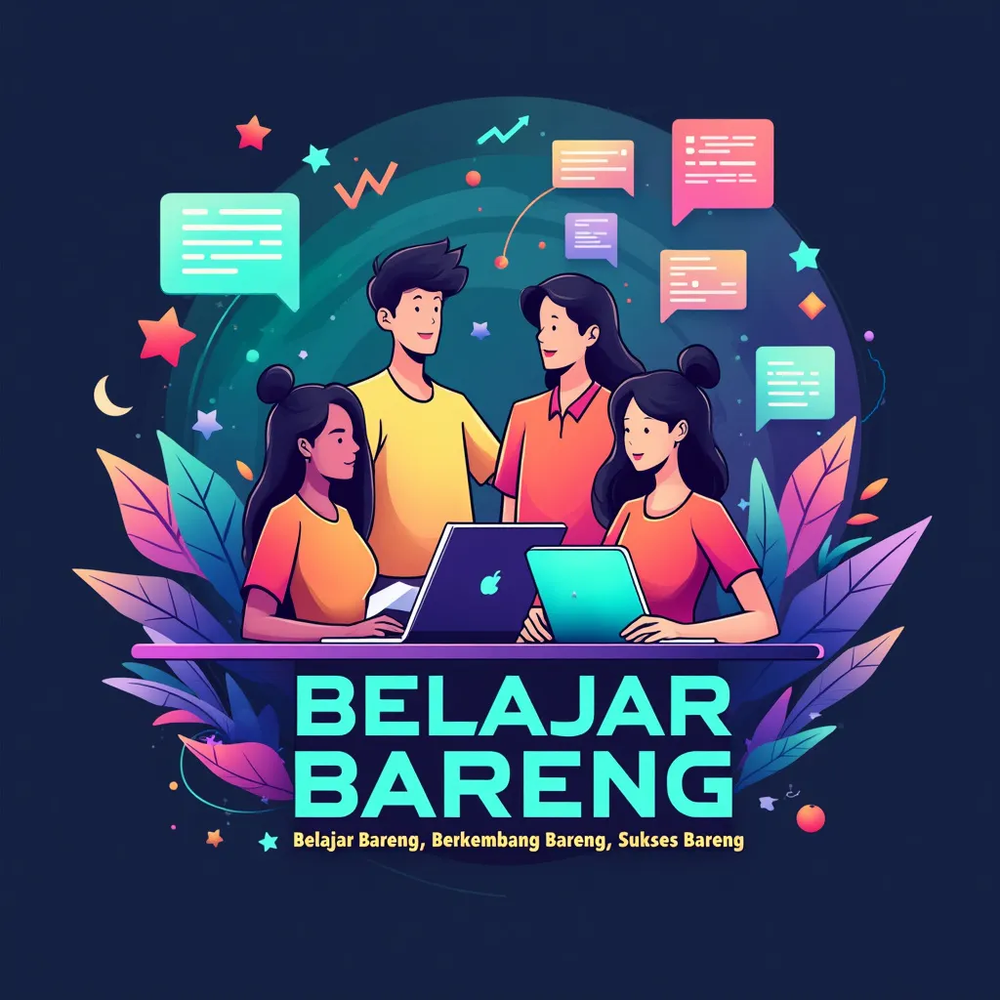

 

 

  
  
  

 

  
<h2 align="center">&nbsp;&nbsp;<b>About Community</b></h2>
<pre>
  Belajar Bareng is a coding community of Indraprasta PGRI University students formed in 2024.
  This learning community aims to learn together, discuss and share knowledge or experience in the field of programming.
  And can create projects or coding innovations together.
</pre>
 

  
<h2 align="center"><b> GitHub Stats </b></h2>

